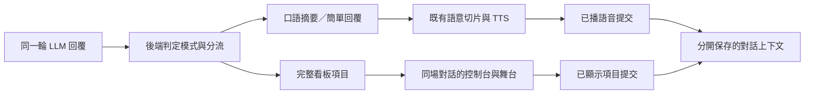

# 按需看板回覆：設計訪談與 HTML 原型

Status: ready-for-human

本文件是需求、查核與原型評估紀錄，尚未批准正式整合。使用者已將舞台設計修正為「影像上的浮動看板」，目前等待評估浮動效果。

## 最新修正：舞台浮動看板（取代下方的舊舞台布局候選）

正式舞台已接上口語／看板分流：簡單回覆只朗讀；步驟、清單、比較會先口述摘要再顯示看板。看板可關閉再開；下一輪對話清除看板。控制台舞台設定含麥克風位置與 9:16 對照預覽，套用後與獨立舞台一致。

- HTML 預設就是 9:16 數字人舞台（對齊 `web/stage.html`），看板作為影像上的浮動視窗，不再放進控制台橫幅插畫。
- 右側設定面板是原型控制，不是舞台的一部分；可隱藏後只看觀眾視角。
- 浮動看板相對影像定位，底部字幕帶保留，看板不壓字幕。預設右上角，252 × 300 px，背景透明度 28%；可再拉大。
- 標題列可拖曳移動，右下角可拖曳縮放；設定提供寬高、0–100% 背景透明度、九宮格位置與左右／上下滑桿。文字不隨背景變淡。
- 位置百分比以可移動範圍計算，0%／100% 對齊影像內兩端（不含字幕帶）；視窗改變時保持相對位置。
- 底部與右側設定均可切換三種視窗樣式：A 毛玻璃視窗、B 場記板、C 廣播字卡。`?variant=A|B|C`。
- 正式控制台「舞台」分頁提供相同三種樣式、長寬、透明度、九宮格位置與預覽開關；套用後寫入 runtime overrides，舞台每 5 秒同步。
- 「儲存設定」在本機瀏覽器保存長寬、透明度與位置。使用獨立 v3 儲存鍵。
- 舊的「舞台各面板互不重疊」驗證不適用。新要求：浮動面板留在影像內、字幕不被覆蓋；人物是否被覆蓋取決於位置與大小。

第一版控制台 A／B／C 與舊舞台對照截圖仍保留於下方；新舞台效果見 [浮動舞台截圖](preview-floating-stage.png)。

## 開啟原型

- [獨立 HTML](../../web/answer-board.prototype.html)：可直接用瀏覽器開啟，無外部套件或 CDN。
- 從專案根目錄執行 `python3 -m http.server 8765 --bind 127.0.0.1 --directory web`，開啟 `http://127.0.0.1:8765/answer-board.prototype.html`。
- 底部切換 A／B／C 看板視窗樣式；URL 的 `?variant=A|B|C` 可指定。預設即為 9:16 舞台浮動看板。
- 兩個視圖共用本頁模擬對話；本原型沒有建立真實跨頁 WebRTC 會話或後端同步。
- 固定情境：準備流程、問候、單一事實、方案比較、看板失敗。另有插話、追問第二點、歷史看板與重試操作。
- 寬、高可拖曳、以方向鍵微調、用滑桿或數字調整。舞台尺寸在控制台有即時縮小示意，並可切換舞台查看。
- 僅按下「儲存尺寸」時將兩視圖的尺寸存入此瀏覽器。對話留在記憶體，重整回到初始範例；不保存使用者對話。

## 布局候選

| 方案 | 控制台 | 舞台 | 評估重點 |
| --- | --- | --- | --- |
| A 三欄並排 | 對話、數字人、看板分別占欄 | 數字人左、看板右 | 寬螢幕可同時掌握三種內容，建議先看此方案 |
| B 下方閱讀區 | 上方對話與數字人，下方獨立看板 | 數字人在上、看板在下 | 保留人物區寬度，可調寬看板，但增加垂直捲動 |
| C 數字人下方 | 左側對話，右側數字人在上、看板在下 | 看板左、數字人右 | 控制台以文字對話優先，但人物區較小 |

窄畫面改上下排列，過寬設定受可用空間限制，保留設定的目標尺寸。各面板使用獨立布局區；底部方案切換器另留空間，不覆蓋內容。

## 已由使用者確定的需求

- 同一回答可分為數字人的口語摘要與供閱讀的看板回覆。
- 看板以條列方式呈現具體項目，減少數字人朗讀完整內容的需要。
- 系統須區分簡單回覆與適合看板的回覆，並非每次都啟用看板。
- 控制台須提供看板顯示區塊，排版避免遮擋數字人及原有對話區。
- 使用者能在控制台即時調整看板大小。
- 先評估獨立測試 HTML，再決定是否導入正式模組。
- 控制台與獨立舞台都支援看板，由控制台調整尺寸。
- 有值得分項閱讀的步驟、清單、比較才自動啟用，也接受使用者明確要求；不單憑字數啟用。
- 已顯示的看板項目需要進入後續對話上下文，支援「第二點詳細說明」等追問，並與已播語音分開記錄。
- 正式功能應讓控制台與舞台同步同一場對話；這會擴充目前兩頁各自建立會話的行為。
- 兩視圖的看板寬、高分別設定；即時預覽，儲存後保留。
- 口語摘要以 1–3 句為目標，先說結論，完整項目逐項顯示；重要前提不得因摘要而省略。
- 插話停止新增項目，已顯示項目保留供追問。新輪次收合舊看板，新看板就緒後取代；舊項目能從歷史查看。
- 關閉看板只隱藏畫面；清空對話才清除該場對話的看板上下文。
- 看板失敗時保留摘要與可用項目，提示錯誤並提供重試，不自動朗讀全部細節。

詞彙定義見 [CONTEXT.md](../../CONTEXT.md) 的「看板回覆」、「口語摘要」與「已顯示看板項目」。

## 目前工作樹查核（2026-09-08）

本次知識圖索引含有工作樹已不存在的看板檔案與舊議題，不能以索引中的功能名稱推論現有功能。以下依目前磁碟內容判斷。

| 區域 | 現況 | 設計影響 |
| --- | --- | --- |
| 控制台 | `web/src/App.vue`：左側對話、右側數字人；主要布局為 `1fr 500px`，窄畫面改上下排列 | 看板需有獨立布局空間，尺寸變更須保護對話與數字人的可用面積 |
| 舞台設定 | `web/src/composables/useRuntimeSettings.js` 的 `applyStageSettings` 目前只送出 `caption_max_chars` | 字幕字數上限與看板視窗尺寸是不同設定 |
| 模型回覆 | `src/llm/base.py` 將回覆 chunk 經文字切片後交付數字人；未有口語／看板分流 | 分流邊界必須在 TTS 之前，不能只在瀏覽器隱藏文字 |
| 控制台紀錄 | `web/src/consoleTurnCommit.js` 的 `applyTurnCommitted` 以 `played_text` 取代生成預覽，空值時移除預覽 | 看板不可直接混入現有語音紀錄，否則可能被提交覆蓋或移除 |
| 多頁顯示 | 控制台與獨立舞台各自建立 WebRTC 會話 | 若要求跨頁同一回答同步，需要先確定會話關係 |

工作樹已有使用者修改，涉及 LLM、語音會話、TTS、數字人與舞台。本階段只新增獨立原型、設計紀錄與已確定詞彙，未修改正式功能。

## 與既有決策的關係

- [ADR 0003](../../docs/adr/0003-server-owned-conversation-turns.md)：輪次編排由伺服器擁有；模型分類與內容分流的正式設計應維持單一編排責任。
- [ADR 0007](../../docs/adr/0007-stream-replies-with-turn-isolation-and-audio-clock.md)：取消後只提交已播回覆，舊輪次輸出必須隔離。
- [ADR 0009](../../docs/adr/0009-bounded-stage-caption-window.md)：舞台字幕是已播內容的有限窗口；看板不是字幕窗口擴大。
- [ADR 0010](../../docs/adr/0010-console-rest-state-follows-turn-commit.md)：靜態紀錄只含已播回覆。使用者已確認看板需要留存並支援追問，因此正式整合必須擴充視覺內容的提交契約；原 ADR 與目前程式維持原狀。
- [ADR 0011 提案](../../docs/adr/0011-separate-spoken-and-displayed-answer-commit.md)：記錄已確認的產品方向與待實作的雙通道提交責任，狀態為 proposed，待正式整合時收斂事件與確認機制。

## 設計決策樹

```text
按需看板回覆（已確定）
├─ Q1 顯示範圍：控制台與舞台（已確認）
│  ├─ Q4 兩頁同步同一場對話（已確認）
│  │  └─ 正式事件、觀看端確認與重連契約（整合階段設計，原型不冒充已實作）
│  └─ Q5 兩頁寬高分別設定、即時預覽、明確儲存（已確認）
│     └─ A／B／C 布局由 HTML 原型比較（待使用者評估）
├─ Q2 啟用條件：適合分項閱讀或明確要求（已確認）
│  ├─ Q6 口語 1–3 句先說結論、完整項目逐項呈現（已確認）
│  └─ Q8 看板失敗保留摘要並提供重試（已確認）
└─ Q3 已顯示看板進入後續對話上下文（已確認）
   ├─ Q7 插話保留已顯示內容、新輪次收合、清空對話清除（已確認）
   └─ 正式顯示提交與語音提交的事件契約（整合階段設計）
```

第一輪決定（使用者已接受）：

1. 控制台與舞台都能顯示，由控制台調整大小；第二輪已確定共享同一場對話。
2. 有值得分項閱讀的步驟、清單、比較才啟用，也接受使用者明確要求；避免只看字數。
3. 已顯示看板可供下一輪追問，與已播語音分別記錄。發送、顯示與實際閱讀不可視為同一件事，提交判定需後續確認。

## HTML 原型評估項目

- 保留現有控制台對話、數字人與輸入區的資訊層級，對比不遮擋的布局候選。
- 用固定模擬資料示範簡單回覆與口語摘要搭配條列看板，明確標示沒有串接真實 LLM。
- 大小調整立即反映，提供可見尺寸與鍵盤可操作的控制項。
- 在窄畫面與大尺寸看板下檢查文字閱讀、捲動、輸入區與數字人可見性。
- 原型回饋只批准所選互動與版面，正式整合需使用者另行確認。

## 正式整合方向（尚未實作）



正式功能的下一步需覆蓋兩種回覆模式，不能只調整 prompt 或在前端拆字串。還需處理模型輸出格式驗證、輪次隔離、逐項順序、重送去重、重連、顯示確認以及新增視覺內容後的歷史契約。前端收到事件不代表使用者已閱讀。

原型的 `items` 僅代表模擬已顯示項目；收合期間生成的項目暫存，重新展開才計入可追問內容。插話丟棄尚未顯示的項目。這用於檢查產品行為，不是正式交付確認協定。

## 原型驗證

- Chromium 瀏覽器檢查：375、768、1024、1280、1512、1920 px 寬度，A／B／C 與兩種視圖，最小／最大尺寸共 72 組，沒有面板互相重疊或水平溢出。
- 已操作簡答不開看板、歷史展開、引用第二點追問、插話後停止後續項目、收合期間不將未顯示項目計入記憶、失敗後補齊而不重複項目。
- 已操作兩視圖分開調整、儲存後重整、鍵盤及滑鼠拖曳、切換視圖保留內容、清空對話但保留尺寸。
- 未出現瀏覽器 JavaScript 錯誤。此檢查不代表真實 LLM、TTS 或跨頁會話已經驗證。
- 預覽截圖：[A](preview-A.png)、[B](preview-B.png)、[C](preview-C.png)、[舞台](preview-stage.png)、[窄畫面](preview-mobile.png)。

## Comments

2026-09-08：開始 grill-with-docs 第一輪。尚未收到 Q1–Q3 回覆，未建立 HTML、未新增正式看板功能。

2026-09-08：使用者回覆「1.兩者都支援，由控制台調整尺寸。2.同意建議 3.同意建議」，Q1–Q3 已確定。進入第二輪，仍未批准正式整合。

2026-09-08：使用者回覆「根據建議」，Q4–Q8 已確定。製作獨立 HTML 原型，進入布局評估；正式整合仍等待使用者確認。

2026-09-08：使用者要求舞台改為可調大小、透明程度與位置的浮動視窗；新舞台原型取代第一版獨立面板設計。正式整合仍未授權。

2026-09-08：使用者要求三種視窗樣式放到控制台並套用到目前舞台。控制台舞台設定與 `/api/stage`、`stage.html` 浮動看板已接上；看板內容仍為預覽範例。

2026-09-08：正式接上口語／看板分流、看板開關與新輪次清除，以及麥克風位置與控制台舞台對照預覽。

2026-09-08：grill-with-docs 再開一輪，範圍是「看板回覆怎麼開、怎麼跟 LLM 配合」。先前 Q1–Q8（顯示範圍、按需啟用、已顯示項目進上下文）維持有效。本輪先問能力開關、誰判定這一輪、視窗何時打開、口語與看板字數是否分開。未改 CONTEXT.md，未批准新 ADR。
