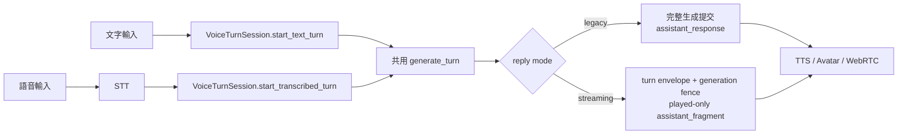

# Phase 7: 統一文字／語音輸入的回覆模式與延遲語意

Type: task
Status: ready-for-human

## 問題摘要

目前設定面板雖可選擇 `legacy` 或 `streaming`，但使用者實測有以下現象：

1. 舊有模式與串流模式的實際回覆效果幾乎相同。
2. 文字輸入會等待 HTTP 完整回應後一次顯示全文。
3. 語音輸入會透過 WebRTC 事件依已播放片段逐段顯示。
4. 語音輸入明顯慢於文字輸入。

這不是單一前端顯示問題，而是文字與語音分別走兩套編排入口，加上模式旗標尚未真正控制 LLM/TTS/history delivery 行為所造成。

本文先記錄分析與完整修改流程；目前已依此文件完成第一輪程式實作，剩餘項目列於文件末尾。

## 現況證據

### 1. 文字輸入繞過語音輪次編排

`web/src/App.vue::sendChatMessage()` 呼叫 `/human`，等待 JSON 回應後才執行：

```js
if (data.response || data.text) {
  addMessage(data.response || data.text, 'ai')
}
```

`src/server/routes/chat.py::human()` 直接在 executor 內呼叫 `llm_response()`，沒有經過 `VoiceTurnSession`，也沒有建立 `turn_id`、generation、mode-specific delivery 或 playback commit。

因此文字輸入必然是「完整 HTTP response 到達後一次顯示」，不會收到 `assistant_fragment`。

### 2. 語音輸入固定使用逐段 TTS 路徑

`src/server/voice_session.py::VoiceTurnSession._process_turn()` 在 STT 完成後固定呼叫：

```python
llm_response(
    text,
    self.avatar,
    stream_to_avatar=True,
    datainfo={"turn_id": turn_id, "generation": generation},
    chunk_guard=...,
    defer_history_commit=True,
)
```

不論 `_pipeline_mode` 是 `legacy` 或 `streaming`，上述參數都相同。也就是兩種模式目前都使用：

- turn envelope；
- generation guard；
- 逐句送入 TTS；
- 延後 history commit；
- 依實際播放片段送出 `assistant_fragment`。

`_pipeline_mode` 現在主要只影響 circuit breaker 記錄、metrics mode 與錯誤處理；沒有選擇兩條不同的回覆管線。

### 3. 前端只有語音事件會逐段更新

`web/src/App.vue::handleVoiceEvent()` 會累加 `assistant_fragment`：

```js
lastMessage.text += event.text
```

文字輸入則不走這個事件入口，所以即使底層 `llm_response()` 已逐句送給 TTS，畫面仍只會在 HTTP 結束後看到完整回覆。

### 4. 語音輸入有不可省略的額外階段

文字輸入目前的路徑是：

```text
文字送出 → LLM → HTTP 完整回覆／TTS
```

語音輸入目前的路徑是：

```text
發話結束 → STT → LLM 首 token → 可播片段 → TTS 首音 → MuseTalk/WebRTC → 畫面提交
```

語音比文字慢是部分合理、部分可優化：

- 合理成本：STT、TTS、音訊編碼與 WebRTC 播放。
- 可優化成本：模式沒有真正分流、文字與語音使用不同編排、Edge TTS 首包／retry、片段形成時間與媒體排程。
- 不可用「文字先顯示、音訊稍後才播」偽裝串流模式變快，因 ADR 0007 規定串流模式只能提交使用者實際收到的已播內容。

## 根因結論

### 主要根因

文字輸入 `/human` 與語音輸入 `VoiceTurnSession` 是兩套互不相同的回覆入口。回覆模式只在 `VoiceTurnSession._start_turn_context()` 被讀取，文字路由完全不知道目前模式。

### 次要根因

`VoiceTurnSession._process_turn()` 沒有依 `_pipeline_mode` 分支；legacy 與 streaming 都呼叫同一組 streaming-specific 參數，所以設定雖然生效，使用者能感受到的行為並未切換。

### 顯示層根因

文字輸入依賴完整 HTTP response，語音輸入依賴 WebRTC `assistant_fragment`。輸入來源意外決定了回覆呈現方式，違反「回覆模式應獨立於輸入方式」的產品語意。

## 目標行為契約

輸入方式只決定是否需要 STT；回覆方式只能由設定中的 reply mode 決定。

| 輸入 | 舊有模式 `legacy` | 串流模式 `streaming` |
|---|---|---|
| 文字輸入 | 不經 STT；LLM 完成後送出一次 `assistant_response`；沿用完整生成內容提交 history | 不經 STT；LLM/TTS 逐段處理；畫面只累加已實際播放的 `assistant_fragment`；只提交已播內容 |
| 語音輸入 | STT 後與文字輸入共用 legacy generation；LLM 完成後一次顯示全文 | STT 後與文字輸入共用 streaming generation；依播放進度逐段顯示 |
| 中斷 | 保留舊路徑的 best-effort rollback 語意，UI 明確標示保護較少 | generation fence 必須阻止舊文字、音訊與影格重新進入輸出 |
| 回覆歷史 | 生成完成即提交完整助手回覆 | 輪次結束時只提交已播回覆 |
| 可見效果 | 完整回答一次出現 | 隨實際播放進度逐段出現 |

注意：兩種模式都可以在內部把文字切成 TTS 片段。是否分句合成是降低首音的 TTS 技術細節；「畫面一次顯示或逐段顯示」以及「history 提交完整生成或已播內容」才是兩種模式的使用者契約。

## 目標架構



核心原則：

1. 文字與語音只在「是否需要 STT」之前分開。
2. STT 完成後，兩者必須進入同一個 `generate_turn()` seam。
3. `generate_turn()` 是唯一能依 reply mode 選擇 legacy 或 streaming policy 的位置。
4. HTTP `/human` 只負責驗證、啟動輪次與回傳 acknowledgement，不再擁有 LLM generation。
5. 助手文字一律由會話事件送到前端，避免 HTTP response 與 WebRTC event 雙重加入訊息。

## 完整修改流程

### Step 0：先建立可重現的紅燈測試

在任何 production code 修改前，新增能直接捕捉本問題的測試。建議測試命令：

```bash
.venv/bin/python -m unittest -v \
  tests.test_voice_session.ReplyModeBehaviorTests \
  tests.test_chat_routes.ChatReplyModeRouteTests

cd web && node --test tests/replyModeDelivery.test.js
```

紅燈必須證明：

1. 現行 legacy 與 streaming 語音輪次傳給 `llm_response()` 的參數完全相同。
2. 現行 `/human` 不經 `VoiceTurnSession`。
3. 現行文字輸入只能在 HTTP 完整回應後加入助手訊息。
4. 相同文字在 text/voice source 下，進入的 generation seam 不同。

不可只測 `config.reply_streaming.enabled` 有沒有變化；那只能證明設定保存，不能捕捉使用者回報的行為錯誤。

### Step 1：定義輸入來源與 delivery policy

在 `src/server/voice_session.py` 增加明確的內部概念：

```python
InputSource = Literal["text", "speech"]
ReplyMode = Literal["legacy", "streaming"]
```

若專案不希望引入 type alias，至少在方法參數與事件 payload 中固定使用上述字串，不要以「是否有 audio」或「是否有 datainfo」反推模式。

建議建立下列小型結果物件：

```python
@dataclass(frozen=True)
class StartedTurn:
    turn_id: str
    mode: str
    input_source: str
```

此物件只回傳輪次識別，不回傳完整 LLM 內容。

### Step 2：在 VoiceTurnSession 建立文字輪次入口

新增非阻塞入口：

```python
async def start_text_turn(self, text: str, *, interrupt: bool = True) -> StartedTurn:
    ...
```

責任：

1. `strip()` 並拒絕空文字。
2. 若已有進行中輪次且 `interrupt=True`，必須 `await self.interrupt()`；不能只呼叫 `avatar.flush_talk()`。
3. 建立新的 `turn_id`、讀取下一輪 mode、初始化 metrics。
4. 將 `input_source="text"` 保存在該輪次 context。
5. 建立 `_process_text_turn()` task 後立即回傳 `StartedTurn`，不可讓 `/human` 等完整 LLM 回覆。
6. 不送 `user_transcript`，因前端在送出文字時已加入 user message；或改送帶 `input_source` 的事件並由前端去重，兩者只能擇一。

### Step 3：抽出文字／語音共用 generation seam

將 `_process_turn()` 拆成兩階段：

```python
async def _process_audio_turn(...):
    text = await transcribe(...)
    await self._generate_turn(text, turn_id, generation, input_source="speech")

async def _process_text_turn(...):
    await self._generate_turn(text, turn_id, generation, input_source="text")
```

共用方法：

```python
async def _generate_turn(
    self,
    text: str,
    turn_id: str,
    generation: int,
    *,
    input_source: str,
) -> None:
    ...
```

`_generate_turn()` 必須單獨擁有：

- `state=llm`／`state=tts_ready` 事件；
- LLM executor 呼叫；
- legacy/streaming policy 分支；
- generation 完成、錯誤、取消與空回覆處理；
- assistant delivery 事件；
- history terminal handling；
- mode-specific circuit breaker 記錄。

如此可以直接用同一個單元測試比較 text 與 speech 在 STT 之後的行為。

### Step 4：真正分開 legacy 與 streaming policy

#### Legacy branch

呼叫 `llm_response()` 時沿用舊路徑語意：

```python
llm_response(
    text,
    self.avatar,
    stream_to_avatar=True,
    defer_history_commit=False,
)
```

規則：

1. 不使用 streaming turn envelope 作為 history/playback contract。
2. LLM 仍可逐句送 TTS，以保留較低首音；這不代表 UI 要逐段顯示。
3. LLM 完整生成後送一次：

```json
{
  "type": "assistant_response",
  "turn_id": "...",
  "text": "完整回答",
  "mode": "legacy",
  "input_source": "text|speech"
}
```

4. legacy history 由 `llm_response()` 在生成完成後提交完整內容。
5. `_finish_tail_guard()` 不可再對 legacy 呼叫 played-only `_commit_history()`，避免兩種 history policy 重疊。
6. metrics 仍保留，但 circuit breaker success/error 只記錄 streaming。

#### Streaming branch

維持目前可靠管線參數：

```python
llm_response(
    text,
    self.avatar,
    stream_to_avatar=True,
    datainfo={"turn_id": turn_id, "generation": generation},
    chunk_guard=...,
    defer_history_commit=True,
)
```

規則：

1. `assistant_fragment` 只能在 `on_output_audio_frame()` 確認非靜音音訊已實際送出後發布。
2. interruption/disconnect 後，舊 generation 不可送出任何新文字、音訊或視訊。
3. history 只能在 terminal state 提交 `played_assistant_text`。
4. 不可另外送完整 `assistant_response`，否則前端會重複顯示或暴露未播放內容。
5. circuit breaker 開啟時該輪可 fallback legacy，但事件中的實際 `mode` 必須是 `legacy`，不能仍宣稱 streaming。

### Step 5：讓 `/human` 成為薄路由

修改 `src/server/routes/chat.py::human()`：

1. 驗證 `sessionid` 存在於 `state.voice_sessions` 與 `state.avatar_streams`。
2. `type="echo"` 保持獨立朗讀功能，不進 LLM reply mode。
3. `type="chat"` 改呼叫：

```python
started = await state.voice_sessions[sessionid].start_text_turn(
    params["text"],
    interrupt=bool(params.get("interrupt")),
)
```

4. 立即回傳 acknowledgement：

```json
{
  "code": 0,
  "msg": "accepted",
  "turn_id": "...",
  "reply_mode": "legacy|streaming",
  "delivery": "events"
}
```

5. 不再從 HTTP 回傳完整 `response`，避免前端與 WebRTC event 各加入一次。
6. 若 voice event data channel 尚未 ready，回傳明確的 `409`，要求前端重連；不可接受請求後靜默遺失助手訊息。
7. 將原本只做 `avatar.flush_talk()` 的 interrupt 改由 `VoiceTurnSession.interrupt()` 管理 generation、media queue、history 與 gate。

### Step 6：統一前端事件呈現

修改 `web/src/App.vue`：

1. `sendChatMessage()` 仍立即加入 user message。
2. `/human` 成功只代表輪次已接受，不再讀取 `data.response` 加入助手訊息。
3. 新增 `assistant_response` handler：

```js
if (event.type === 'assistant_response' && event.text) {
  isThinking.value = false
  addMessage(event.text, 'ai', { voiceTurnId: event.turn_id })
}
```

4. `assistant_fragment` handler 保持累加，但只服務 streaming mode。
5. `sendChatMessage()` 的 `finally` 不可無條件將 `isThinking=false`；應由第一個 assistant event、terminal error 或 turn cancellation 關閉。
6. 以 `turn_id` 去重，防止重連、retry 或遲到事件重複建立訊息。
7. `user_transcript` 只加入 speech source；若後端未提供 source，需在事件加入 `input_source` 後再判斷。

### Step 7：修正設定文案，避免錯誤承諾

目前「舊有模式（較快開始）」尚未有穩定 benchmark 證據。完成實測前建議改為：

- `舊有模式（完整顯示）`
- `串流模式（逐段播放提交）`

說明文字應明確揭露：

- 舊有模式：回答生成完成後一次顯示，history 保存完整生成內容，中斷保護較少。
- 串流模式：依實際播放逐段顯示，只保存已播內容，支援輪次隔離與中斷復原。
- 語音輸入仍需 STT/TTS，因此不會與純文字輸入有相同端到端延遲。

只有在相同硬體、模型、TTS 的量測證明 legacy 顯著較快後，才能恢復「較快開始」文案。

涉及檔案：

- `web/src/locales/zh-TW.js`
- `web/src/locales/zh-CN.js`
- `web/src/locales/en-US.js`
- `web/src/components/SettingsPanel.vue`

### Step 8：建立公平的延遲量測

不可只比較「按下文字送出」與「開始說話」到顯示結果，因兩種輸入起點不同。每輪至少記錄：

| Timestamp | 定義 |
|---|---|
| `input_complete_at` | 文字送出或語音發話結束 |
| `transcript_ready_at` | 文字輸入等同 input complete；語音輸入為 STT 完成 |
| `llm_first_token_at` | 收到第一個有效 LLM token |
| `first_fragment_ready_at` | 第一個可播語意片段形成 |
| `tts_request_at` | 第一段送入 TTS |
| `tts_first_pcm_at` | 收到第一個非靜音 PCM |
| `webrtc_first_audio_at` | 第一個非靜音 WebRTC frame 送出 |

產出兩組指標：

1. 使用者端端到端：`webrtc_first_audio_at - input_complete_at`。
2. 公平比較 LLM/TTS：`webrtc_first_audio_at - transcript_ready_at`。

語音相對文字多出的 STT 成本應獨立呈現：

```text
stt_seconds = transcript_ready_at - input_complete_at
```

不得修改 ADR 0007 的首音定義來讓數字變好；正式 voice SLO 仍從發話結束開始計算。

### Step 9：依量測順序優化語音首音

只有完成 Step 8 後才進行效能修改，且一次只改一個變因：

1. 確認 STT model 已在 session prepare 預熱，不在每輪重新載入。
2. 確認 LLM request 在 transcript ready 後立即開始，沒有等待 UI/HTTP。
3. 量測 `llm_first_token → first_fragment_ready`，必要時調整可播片段策略，但不可切斷詞語。
4. 量測 Edge TTS connect／first byte／first PCM；分開首次連線、正常連線與 retry 樣本。
5. 檢查 TTS 是否能安全復用連線或改用穩定低延遲的本機引擎。
6. 檢查 MuseTalk/WebRTC pacing，只允許音訊主時鐘；視訊落後不得拖慢音訊。
7. 每一項優化後重跑 5-turn preflight，再跑 50-turn soak。

現有 50-turn 實測基線：

- 首音 P50：1.991518 s（目標 ≤ 1.2 s）
- 首音 P95：3.928302 s（目標 ≤ 2.5 s）
- A/V P95：0.095 s（目標 ≤ 0.08 s）

在新量測證明通過前，`reply_streaming.enabled` 預設仍須維持 `false`。

## 回歸測試清單

### Backend unit tests

1. `test_legacy_voice_turn_uses_legacy_generation_policy`
   - 不傳 turn-aware `datainfo`、`chunk_guard`、`defer_history_commit=True`。
   - 生成完成只送一次 `assistant_response`。

2. `test_streaming_voice_turn_uses_guarded_generation_policy`
   - 必須傳 turn/generation envelope。
   - 必須延後 history commit。
   - 未播放前不可送 `assistant_fragment`。

3. `test_text_and_speech_share_generate_turn_after_transcription`
   - text 與 speech source 都呼叫相同 `_generate_turn()`。
   - 唯一差異是 speech 先經 STT。

4. `test_streaming_text_turn_only_emits_played_fragments`
   - LLM 已生成但音訊未播放時，助手內容不可出現在事件或 history。

5. `test_legacy_text_turn_emits_one_complete_response`
   - 多個 LLM chunks 最終只產生一個完整 UI event。

6. `test_text_interrupt_fences_previous_streaming_generation`
   - 新文字輪次開始後，舊 executor 不可重新 enqueue。

7. `test_legacy_tail_guard_does_not_double_commit_history`

8. `test_streaming_circuit_fallback_reports_effective_legacy_mode`

### Route tests

1. `/human` chat 必須呼叫 `VoiceTurnSession.start_text_turn()`。
2. 成功回應是 acknowledgement，不包含完整 LLM response。
3. session 不存在回傳 404/409，而不是 KeyError 包在 HTTP 200 的 `code=-1`。
4. event channel 未 ready 時不得接受後靜默丟結果。
5. echo 路徑不受 reply mode 影響。

### Frontend tests

1. HTTP acknowledgement 不會直接加入 ai message。
2. legacy `assistant_response` 一次加入完整訊息。
3. streaming `assistant_fragment` 依相同 turn id 累加。
4. 同一 turn id 的重複事件會去重。
5. text source 不會因 `user_transcript` 重複加入 user message。
6. `isThinking` 由事件 terminal state 管理，不在 HTTP finally 過早關閉。

### Full regression

```bash
.venv/bin/python -m unittest discover -s tests
cd web && npm test
cd web && npm run build
.venv/bin/python -m compileall -q src tests
git diff --check
```

## 驗收情境

使用同一個模型、prompt、TTS、角色，各執行以下四格至少 5 輪：

| 情境 | 預期 |
|---|---|
| 文字 × legacy | user message 立即出現；assistant 在 LLM 完成後一次出現；語音可提早逐句合成但畫面不逐段 |
| 語音 × legacy | STT transcript 出現；assistant 完整回覆只出現一次；不產生 streaming fragment UI |
| 文字 × streaming | HTTP 快速 accepted；assistant 只隨已播放音訊逐段出現 |
| 語音 × streaming | STT 後與文字 streaming 相同；插話後舊片段不得再出現 |

額外驗收：

1. 四種情境都只能產生一個有效 active turn。
2. 不可出現重複 user/assistant message。
3. 切換設定後從下一輪生效，不修改進行中的輪次。
4. streaming interrupt 後 stale output 必須為 0。
5. legacy 與 streaming 的 metrics 必須標示實際 effective mode。
6. 語音延遲報表同時提供 STT 成本與 transcript-ready 後延遲。

## 風險與防護

### 事件通道尚未開啟

文字 chat 改成 event delivery 後，data channel 是回覆可見性的必要條件。路由必須在接受請求前確認 event sink ready，或實作明確的 HTTP fallback；不可默默接受。

### legacy 中斷後舊 executor 回流

若 legacy 要完全復原舊行為，其 best-effort cancellation 可能允許已在 executor 的舊輸出回流。UI 說明必須揭露，測試也需鎖定這是 legacy 限制而非 streaming regression。

若產品無法接受任何 stale output，則 legacy 仍應保留 generation guard，但名稱不應宣稱是「舊有模式」；應改名為「完整顯示模式」。此產品決策必須在實作前確認並記入 ADR。

### history policy 混用

legacy full-generation commit 與 streaming played-only commit 不能同時作用於同一輪。`_finish_tail_guard()`、error path、interrupt path 都必須依 effective mode 選擇唯一 terminal owner。

### 文字顯示早於實際播放

streaming 模式不得在 HTTP response 或 LLM chunk 到達時先顯示未播放文字，否則 interruption 後 UI/history 會宣稱使用者收到實際上未播出的內容。

## 回滾方案

1. 保持 checked-in `reply_streaming.enabled: false`。
2. 新的共用 text-turn 入口仍應支援 effective legacy mode。
3. 若 event-delivery 前端發生問題，可暫時將 `/human` legacy 分支回退為完整 HTTP response；streaming 分支不可回退成未播放內容直出。
4. 使用 `LINLY_REPLY_STREAMING_ENABLED=0` 做 process-scoped rollback。
5. 回滾不得移除新增的 mode-specific tests；應標記 skip 原因並建立 blocker issue。

## 建議實作順序

1. 新增紅燈 backend/frontend tests。
2. 抽出 `_generate_turn()`，先保持現有行為，確保既有測試不變。
3. 新增 `start_text_turn()` 並讓 `/human` 使用它。
4. 改前端只從 voice events 接收助手內容。
5. 實作 legacy/streaming policy 分支。
6. 修正 history terminal ownership 與 circuit fallback effective mode。
7. 更新設定文案與三語系。
8. 跑 targeted tests、full regression、production build。
9. 做四格人工驗收。
10. 加入 stage timestamps，跑 5-turn preflight。
11. 通過後跑 50-turn soak；未達 SLO 則預設繼續關閉。

## 完成定義

- 文字／語音在 STT 之後共用同一個 generation seam。
- legacy 與 streaming 有不同且測試可觀察的 delivery/history/cancellation policy。
- 回覆呈現由 reply mode 決定，不再由 input source 決定。
- `/human` 不再直接擁有 LLM generation。
- 不重複顯示 user 或 assistant message。
- streaming 仍符合 ADR 0007 的 played-only commit 與 generation fencing。
- 完整 Python/Web 測試與 production build 全部通過。
- 實機延遲拆解可分辨 STT、LLM、fragment、TTS 與 WebRTC 成本。
- 串流預設是否開啟仍由 Phase 6 真實 SLO gate 決定，不因本任務功能完成自動開啟。

## Comments

- 2026-08-31: 根據使用者實測完成靜態路徑分析。確認 `/human` 文字路由繞過 `VoiceTurnSession`，且語音輪次的 legacy/streaming 目前使用相同 `llm_response()` streaming 參數。依使用者要求只產出本修改流程文件，未進行程式修改。
- 2026-08-31: 依本文件完成第一輪實作：文字 chat 改由 `VoiceTurnSession.start_text_turn()` 非阻塞啟動；`legacy` 送出單一 `assistant_response`，`streaming` 維持已播放 `assistant_fragment`；前端不再從 HTTP 完整 response 直接加入助手訊息；事件通道未就緒時 `/human` 回傳 409。192 Python tests、23 Web tests、Vite build、compileall 與 diff check 均通過。
- 2026-08-31: 剩餘項目：實際四格人工驗收（文字／語音 × legacy／streaming）、確認不中複製 user/assistant 訊息、STT→LLM→fragment→TTS→WebRTC 分段延遲量測、5-turn preflight 與 50-turn soak。實機 SLO 未重新驗證前，`reply_streaming.enabled` 預設維持 `false`。
