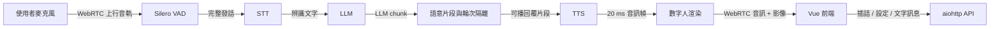

# Linly-Talker-Stream

以 WebRTC 串起語音辨識、LLM、語音合成與數字人渲染的即時對話系統。前端提供繁體中文操作介面，並可在設定頁直接切換模型、角色、VAD、STT、TTS、預設 Prompt、回覆字數與舊有／串流回覆模式。

> 想先看圖再讀文件？直接用瀏覽器開啟 [`docs/project-overview.html`](docs/project-overview.html)。目前完成度、驗證證據與剩餘工作請看 [`docs/project-status.md`](docs/project-status.md)。

## 30 秒理解



系統由伺服器擁有完整的「對話輪次」：Silero 判定使用者說完後，後端完成 STT，再將 LLM chunk 切成可播回覆片段，依序交給 TTS 與 Avatar。文字、音訊與影格都攜帶 `turn_id`、generation 與 sequence；插話或斷線後，舊輪次資料會在各輸出邊界被拒絕。數字人開始或停止說話時，伺服器也會主動推送狀態，讓前端正確暫停或恢復收音。

## 目前具備的功能

- 全雙工 WebRTC 音訊與影像傳輸，支援免按對話、按住說話與按鍵插話。
- 可選的可靠回覆語音串流：LLM 尚未完成全文時，已完成語意的片段即可開始合成與播放。
- 端到端輪次隔離、取消柵欄、播放提交、字幕同步、已播回覆 history 與有界媒體背壓。
- Silero 服務端串流 VAD，瀏覽器只傳輸音訊，不自行切段。
- STT：faster-whisper、FunASR。
- LLM：Ollama 與 llama.cpp，可列出並切換本機模型。
- TTS：Edge TTS、GPT-SoVITS、XTTS、CosyVoice、Fish TTS、IndexTTS2。
- 數字人：Wav2Lip、MuseTalk、Ultralight、ER-NeRF、TalkingGaussian。
- MuseTalk 段落邊界嘴型連續控制，只融合嘴部 ROI，不以音訊緩衝換取平滑。
- 設定頁可修改預設 Prompt、約略回覆字數、回覆模式、數字人角色、VAD、STT 與 TTS。
- Edge TTS 直接列出臺灣華語聲音：曉臻、曉雨與雲哲。
- 設定套用前執行可用性檢查與語音試聽，成功後才持久化至 YAML。
- llama.cpp 可由後端自動啟動；正常退出、Ctrl-C 或 SIGTERM 時會停止本程式擁有的 llama-server。
- 繁體中文與英文介面。

## 回覆模式與完成度

可靠回覆語音串流已完成並通過 Edge TTS＋MuseTalk 單一會話的 50 回合實機 SLO；為保留跨引擎相容與回退能力，設定預設仍是舊有模式。

| 路徑 | LLM 輸出 | 送入 TTS 與數字人的時機 | 現況 |
| --- | --- | --- | --- |
| 串流模式 | 逐 chunk 接收並以語意邊界切片 | 可播回覆片段形成後立即排入有界 TTS／數字人管線 | 已完成；Edge＋MuseTalk 通過正式 SLO，預設關閉 |
| 舊有模式 | 等待完整 LLM 回覆 | 全文一次排入 TTS／數字人 | 畫面一次顯示，TTS 也一次合成 |

串流模式不是增量波形 TTS：每個可播回覆片段仍由所選 TTS 引擎個別合成。其可靠性契約包含 generation fence、取消後零 stale output、音訊主時鐘、首個非靜音音訊提交字幕／history，以及有限媒體債務。完整狀態與限制請看 [專案狀態](docs/project-status.md)，設計背景請看 [ADR-0007](docs/adr/0007-stream-replies-with-turn-isolation-and-audio-clock.md)。

## 專案架構

```text
Linly-Talker-Stream/
├── config/                 # 服務、模型、語音、VAD 與 Prompt 設定
├── docs/                   # ADR、研究、架構說明與功能路線圖
├── scripts/                # 安裝、模型下載、憑證與啟動腳本
├── src/
│   ├── asr/                # STT 介面、工廠與各引擎
│   ├── avatars/            # 數字人介面、角色素材與五種渲染引擎
│   ├── config/             # YAML schema、載入與設定持久化
│   ├── llm/                # 對話引擎、歷史、Prompt 與句界緩衝
│   ├── server/             # aiohttp、WebRTC、API、輪次、串流管線與執行時設定
│   ├── tts/                # TTS 介面、佇列與各語音引擎
│   └── vad/                # Silero 串流端點偵測
├── tests/                  # Python 單元與整合測試
└── web/
    ├── src/components/     # Vue 操作畫面與設定面板
    ├── src/composables/    # WebRTC、語音狀態、設定與 i18n
    ├── src/locales/        # 繁體中文與英文文案
    └── tests/              # Node 前端邏輯測試
```

| 層級 | 主要責任 | 關鍵位置 |
| --- | --- | --- |
| 互動層 | 視訊、麥克風、字幕、設定與插話控制 | `web/src/` |
| 傳輸與會話層 | WebRTC 協商、事件通道、單一對話輪次 | `src/server/` |
| 語音理解層 | Silero 切分發話，STT 轉成文字 | `src/vad/`、`src/asr/` |
| 回覆層 | Prompt、交易式歷史、Ollama／llama.cpp、語意切片與回覆長度 | `src/llm/`、`src/server/reply_streaming/` |
| 語音與渲染層 | 有界 TTS 佇列、20 ms 音訊幀、音訊主時鐘、嘴型連續與畫面輸出 | `src/tts/`、`src/avatars/` |
| 設定層 | 型別驗證、執行時套用、試聽與 YAML 持久化 | `src/config/`、`src/server/runtime_settings.py` |

## 快速開始

### 需求

- Linux
- Python 3.10 或 3.11；自動安裝腳本使用 Python 3.10.19
- [`uv`](https://docs.astral.sh/uv/)
- Node.js 與 npm
- FFmpeg
- NVIDIA GPU 與相容的 CUDA 環境（建議；部分引擎可使用 CPU，但速度較慢）

### 1. 安裝環境

入門可先選 Wav2Lip；若要使用其他數字人，將參數改成 `musetalk`、`ernerf` 或 `talkinggaussian`。

```bash
git clone https://github.com/s0966066980/Linly-Talker-Stream.git
cd Linly-Talker-Stream
bash scripts/setup-env.sh wav2lip
```

若只想手動安裝核心依賴：

```bash
uv venv --python 3.10.19
uv sync --extra vad
cd web
npm install
cd ..
```

### 2. 準備數字人模型與角色素材

不同 Avatar 的權重與素材需求不同。安裝腳本會處理對應 Python 套件，但仍需依所選引擎放置模型權重與角色資料。MuseTalk 可先執行：

```bash
bash scripts/download_musetalk_weights.sh
```

### 3. 產生本機 HTTPS 憑證

遠端瀏覽器使用麥克風通常需要安全來源；預設設定已開啟 HTTPS。

```bash
bash scripts/create_ssl_certs.sh
```

### 4. 啟動

```bash
bash scripts/start-all.sh config/config.yaml
```

預設入口：

- 前端：`https://localhost:3000`
- 後端健康檢查：`https://localhost:8010/health`
- 後端日誌：`logs/start-all-backend.log`

若 LLM provider 設為 `llamacpp`，後端會按需啟動 `llama-server`；用啟動腳本正常停止、Ctrl-C 或傳送 SIGTERM 時，後端只會清理自己啟動的 llama-server，不會終止外部管理的服務。`kill -9` 無法執行任何應用程式清理，應只作最後手段。

首次開啟自簽憑證頁面時，瀏覽器會顯示安全警告；在本機確認憑證後即可繼續。

## 設定方式

主要設定檔是 [`config/config.yaml`](config/config.yaml)，也可以在前端「設定」面板直接修改。設定 API 會先驗證模型或引擎，通過後才更新執行中狀態並寫回 YAML。

| 分類 | 可調整內容 | 套用注意事項 |
| --- | --- | --- |
| LLM | Ollama／llama.cpp、模型、預設 Prompt、約略回覆字數 | 會更新現有 LLM session；回覆字數是柔性目標 |
| 數字人 | 引擎與角色 | 有進行中會話時不可切換 |
| 回覆模式 | 舊有／串流 | 下一輪生效；串流正式 SLO 目前只保證 Edge TTS＋MuseTalk |
| VAD | 啟用、門檻、靜音、最短／最長發話等 | 立即套用至新的發話判定 |
| STT | Whisper／FunASR、模型、語言、裝置 | 引擎切換時需先中斷會話 |
| TTS | 引擎、聲音、模型、語言、說話者、裝置與指令 | 先執行實際試聽，再保存設定 |

所有麥克風音訊預設只存在短生命週期的記憶體緩衝；除非使用者明確啟動錄製功能，系統不持久保存原始收音。

## 開發與驗證

後端測試：

```bash
uv run python -m unittest discover -s tests
```

前端測試與正式建置：

```bash
cd web
npm test
npm run build
```

整合檢查：

```bash
uv run python scripts/check-integration.py
```

Edge TTS＋MuseTalk 的真實 WebRTC soak：

```bash
uv run python scripts/run_voice_soak.py \
  --base-url https://localhost:8010 \
  --turns 50 \
  --output .scratch/reply-voice-streaming/real-soak-report.json
```

截至 2026-09-01，完整回歸為 234 個 Python 測試與 23 個 Web 測試；正式 50 回合報告達成首音 P50 1.186 秒、P95 1.692 秒、A/V 偏差 P95 60 ms、stale output 0。測試數量會隨功能增加，請以當前命令結果為準。

## 常見問題

### 設定套用失敗

切換 Avatar、STT 或 TTS 前先中斷目前 WebRTC 會話。TTS 設定只有在試聽成功後才會保存，因此模型未下載、服務未啟動或 GPU 記憶體不足都會直接回報錯誤。

### 遠端裝置沒有麥克風權限

確認已執行 `scripts/create_ssl_certs.sh`、`app.ssl` 為 `true`，並使用 HTTPS 開啟前端。正式環境請改用受信任憑證。

### 關閉後 llama.cpp 還在執行

請使用 Ctrl-C、啟動腳本的正常停止流程或 SIGTERM。後端只會追蹤並停止自己啟動的 llama-server；已在後端啟動前存在的外部 llama-server 會刻意保留。SIGKILL（`kill -9`）、斷電或核心崩潰無法觸發清理 hook。

## 已知限制

- 回覆語音串流的正式 SLO 目前只涵蓋 Edge TTS＋MuseTalk、單一活躍會話。
- `reply_streaming.enabled` 預設仍為 `false`；可在設定頁或 YAML 明確啟用。
- direct PCM／decoupled audio clock 實驗路徑預設關閉；正式路徑維持單一 renderer-owned 音訊 producer，避免重複音訊與電子音。
- Legacy 回覆模式仍保留；其他 TTS／Avatar 可使用，但不承諾與主力組合相同的串流延遲。
- 尚未完成多使用者 GPU 排程、正式驗證／rate limit、Docker Compose、完整延遲儀表板與所有引擎能力註冊。

## 延伸文件

- [可視化專案架構與說明](docs/project-overview.html)
- [目前完成度、驗證與限制](docs/project-status.md)
- [後續功能路線圖](docs/project-roadmap.html)
- [架構決策紀錄](docs/adr/)
- [專案共通語言](CONTEXT.md)

## 授權

本專案採用 [Apache License 2.0](LICENSE)。各模型、權重與第三方子專案仍依其各自授權條款使用。
