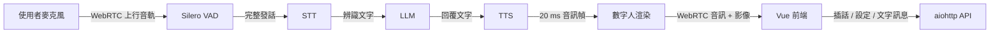

# Linly-Talker-Stream

以 WebRTC 串起語音辨識、LLM、語音合成與數字人渲染的即時對話系統。前端提供繁體中文操作介面，並可在設定頁直接切換模型、角色、VAD、STT、TTS、預設 Prompt 與回覆字數。

> 想先看圖再讀文件？直接用瀏覽器開啟 [`docs/project-overview.html`](docs/project-overview.html)。功能規劃與逐句串流方案則整理在 [`docs/project-roadmap.html`](docs/project-roadmap.html)。

## 30 秒理解



系統由伺服器擁有完整的「對話輪次」：Silero 判定使用者說完後，後端依序完成 STT、LLM、TTS，再把數字人的音訊與畫面透過 WebRTC 傳回瀏覽器。數字人開始或停止說話時，伺服器也會主動推送狀態，讓前端正確暫停或恢復收音。

## 目前具備的功能

- 全雙工 WebRTC 音訊與影像傳輸，支援免按對話、按住說話與按鍵插話。
- Silero 服務端串流 VAD，瀏覽器只傳輸音訊，不自行切段。
- STT：faster-whisper、FunASR、Qwen3-ASR。
- LLM：Ollama 與 llama.cpp，可列出並切換本機模型。
- TTS：Edge TTS、Qwen3-TTS、GPT-SoVITS、XTTS、CosyVoice、Fish TTS、IndexTTS2。
- 數字人：Wav2Lip、MuseTalk、Ultralight、ER-NeRF、TalkingGaussian。
- 設定頁可修改預設 Prompt、約略回覆字數、數字人角色、VAD、STT 與 TTS。
- Edge TTS 直接列出臺灣華語聲音：曉臻、曉雨與雲哲。
- Qwen3 語音模型使用獨立虛擬環境，啟動子程序時自動補齊 NVIDIA 動態函式庫路徑。
- 設定套用前執行可用性檢查與語音試聽，成功後才持久化至 YAML。
- 繁體中文與英文介面。

## 串流能力：目前做到哪裡

本專案目前同時存在兩條處理路徑，不能把它們都稱為「真正逐句串流」：

| 路徑 | LLM 輸出 | 送入 TTS 的時機 | 現況 |
| --- | --- | --- | --- |
| 文字訊息 | 逐 chunk 接收 | 累積到完整句號後立即排入 TTS | 已具備逐句管線 |
| 免按語音對話 | 等待完整 LLM 回覆 | 完整回覆完成後一次排入 TTS | 尚未逐句 |

此外，Qwen3-TTS 目前會先完成整句波形，再切成固定 20 ms 音訊幀送往數字人；它是「音訊幀串流播放」，但不是模型生成期間就持續吐出音訊的增量 TTS。

若要讓語音對話也成為真正的逐句串流，建議讓 `VoiceTurnSession` 直接消費 LLM chunk，在伺服器內以句界緩衝器產生 `sentence_ready` 事件，再把每句依序送入有界 TTS 佇列。完整設計、取消規則與驗收指標請看 [專案規劃與逐句串流設計](docs/project-roadmap.html)。

## 專案架構

```text
Linly-Talker-Stream/
├── config/                 # 服務、模型、語音、VAD 與 Prompt 設定
├── docs/                   # ADR、研究、架構說明與功能路線圖
├── scripts/                # 安裝、模型下載、憑證與啟動腳本
├── src/
│   ├── asr/                # STT 介面、工廠與各引擎
│   ├── avatars/            # 數字人介面、角色素材與五種渲染引擎
│   ├── config/             # YAML schema、載入與設定持久化
│   ├── llm/                # 對話引擎、歷史、Prompt 與句界緩衝
│   ├── server/             # aiohttp、WebRTC、API、輪次與執行時設定
│   ├── speech/             # Qwen3 語音隔離程序與 IPC
│   ├── tts/                # TTS 介面、佇列與各語音引擎
│   └── vad/                # Silero 串流端點偵測
├── tests/                  # Python 單元與整合測試
└── web/
    ├── src/components/     # Vue 操作畫面與設定面板
    ├── src/composables/    # WebRTC、語音狀態、設定與 i18n
    ├── src/locales/        # 繁體中文與英文文案
    └── tests/              # Node 前端邏輯測試
```

| 層級 | 主要責任 | 關鍵位置 |
| --- | --- | --- |
| 互動層 | 視訊、麥克風、字幕、設定與插話控制 | `web/src/` |
| 傳輸與會話層 | WebRTC 協商、事件通道、單一對話輪次 | `src/server/` |
| 語音理解層 | Silero 切分發話，STT 轉成文字 | `src/vad/`、`src/asr/` |
| 回覆層 | Prompt、歷史、Ollama／llama.cpp 與回覆長度 | `src/llm/` |
| 語音與渲染層 | TTS 佇列、20 ms 音訊幀、嘴型與畫面輸出 | `src/tts/`、`src/avatars/` |
| 設定層 | 型別驗證、執行時套用、試聽與 YAML 持久化 | `src/config/`、`src/server/runtime_settings.py` |

## 快速開始

### 需求

- Linux
- Python 3.10 或 3.11；自動安裝腳本使用 Python 3.10.19
- [`uv`](https://docs.astral.sh/uv/)
- Node.js 與 npm
- FFmpeg
- NVIDIA GPU 與相容的 CUDA 環境（建議；部分引擎可使用 CPU，但速度較慢）

### 1. 安裝環境

入門可先選 Wav2Lip；若要使用其他數字人，將參數改成 `musetalk`、`ernerf` 或 `talkinggaussian`。

```bash
git clone https://github.com/s0966066980/Linly-Talker-Stream.git
cd Linly-Talker-Stream
bash scripts/setup-env.sh wav2lip
```

若只想手動安裝核心依賴：

```bash
uv venv --python 3.10.19
uv sync --extra vad
cd web
npm install
cd ..
```

### 2. 準備數字人模型與角色素材

不同 Avatar 的權重與素材需求不同。安裝腳本會處理對應 Python 套件，但仍需依所選引擎放置模型權重與角色資料。MuseTalk 可先執行：

```bash
bash scripts/download_musetalk_weights.sh
```

### 3. 可選：安裝 Qwen3 語音環境

```bash
bash scripts/setup-qwen-speech.sh
```

這會建立 `.venv-qwen-speech`，避免 Qwen3 的新套件版本影響數字人主環境。若使用參考音訊前處理，系統也需要安裝 SoX。

### 4. 產生本機 HTTPS 憑證

遠端瀏覽器使用麥克風通常需要安全來源；預設設定已開啟 HTTPS。

```bash
bash scripts/create_ssl_certs.sh
```

### 5. 啟動

```bash
bash scripts/start-all.sh config/config.yaml
```

預設入口：

- 前端：`https://localhost:3000`
- 後端健康檢查：`https://localhost:8010/health`
- 後端日誌：`logs/start-all-backend.log`

首次開啟自簽憑證頁面時，瀏覽器會顯示安全警告；在本機確認憑證後即可繼續。

## 設定方式

主要設定檔是 [`config/config.yaml`](config/config.yaml)，也可以在前端「設定」面板直接修改。設定 API 會先驗證模型或引擎，通過後才更新執行中狀態並寫回 YAML。

| 分類 | 可調整內容 | 套用注意事項 |
| --- | --- | --- |
| LLM | Ollama／llama.cpp、模型、預設 Prompt、約略回覆字數 | 會更新現有 LLM session；回覆字數是柔性目標 |
| 數字人 | 引擎與角色 | 有進行中會話時不可切換 |
| VAD | 啟用、門檻、靜音、最短／最長發話等 | 立即套用至新的發話判定 |
| STT | Whisper／FunASR／Qwen3-ASR、模型、語言、裝置 | 引擎切換時需先中斷會話 |
| TTS | 引擎、聲音、模型、語言、說話者、裝置與指令 | 先執行實際試聽，再保存設定 |

所有麥克風音訊預設只存在短生命週期的記憶體緩衝；除非使用者明確啟動錄製功能，系統不持久保存原始收音。

## 開發與驗證

後端測試：

```bash
uv run python -m unittest discover -s tests
```

前端測試與正式建置：

```bash
cd web
npm test
npm run build
```

整合檢查：

```bash
uv run python scripts/check-integration.py
```

## 常見問題

### Qwen3-TTS 顯示 cuDNN Frontend 或 `libnvrtc.so.12` 錯誤

目前版本會自動把 Qwen3 獨立環境內的 NVIDIA 函式庫目錄加入 worker 環境。更新程式後請完整重新啟動後端，讓常駐的 Qwen worker 使用新環境；若仍失敗，再重新執行 `bash scripts/setup-qwen-speech.sh`。

### 設定套用失敗

切換 Avatar、STT 或 TTS 前先中斷目前 WebRTC 會話。TTS 設定只有在試聽成功後才會保存，因此模型未下載、服務未啟動或 GPU 記憶體不足都會直接回報錯誤。

### 遠端裝置沒有麥克風權限

確認已執行 `scripts/create_ssl_certs.sh`、`app.ssl` 為 `true`，並使用 HTTPS 開啟前端。正式環境請改用受信任憑證。

## 延伸文件

- [可視化專案架構與說明](docs/project-overview.html)
- [專案規劃與真正逐句串流設計](docs/project-roadmap.html)
- [Qwen3 語音整合研究](docs/research/qwen3-speech-integration.md)
- [架構決策紀錄](docs/adr/)
- [專案共通語言](CONTEXT.md)

## 授權

本專案採用 [Apache License 2.0](LICENSE)。各模型、權重與第三方子專案仍依其各自授權條款使用。
